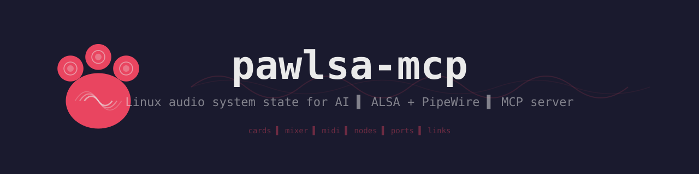

<p align="center">
  
</p>

MCP server for Linux audio systems. Exposes ALSA hardware/MIDI state and PipeWire graph as [MCP](https://modelcontextprotocol.io/) resources and tools over stdio.

Built to give AI assistants (Claude, etc.) direct read/write access to audio routing, mixer levels, and device enumeration on Linux.

## What it does

**Resources** (read-only state):
- ALSA sound cards, PCM devices, mixer elements, device hints, MIDI sequencer ports
- PipeWire nodes, ports, and links with live state from registry listeners

**Tools** (mutations):
- `pw_link_create` / `pw_link_destroy` — route audio between PipeWire ports
- `mixer_set_volume` / `mixer_set_switch` — control ALSA mixer elements (volume, mute)

## Requirements

- Linux with PipeWire and ALSA
- `libasound2-dev` / `alsa-lib`
- `libpipewire-0.3-dev` / `pipewire`
- Rust 2024 edition (1.85+)

## Build

```sh
cargo build --release
```

## Usage with Claude Code

Add to `~/.claude/claude_desktop_config.json` (or your MCP config):

```json
{
  "mcpServers": {
    "pawlsa": {
      "command": "/path/to/pawlsa-mcp"
    }
  }
}
```

Then use `/mcp` in Claude Code to connect. Resources are available via `ReadMcpResourceTool` and tools appear as `mcp__pawlsa__*`.

## Usage with MCP Inspector

```sh
npx @modelcontextprotocol/inspector -- cargo run
```

## Output format

Resources use a specialized columnar format that balances token use with visual clarity for users.

Mostly this is because we couldn't get json or other formats to readable in the claude code output. If the
mime type ever gets respected this could switch to json.

```
id, state, media.class, node.name, node.description, ports(in/out) ▌ 29, suspended, N/A, Dummy-Driver, N/A, 0/0 ▌ 63, suspended, Audio/Sink, alsa_output.usb-..., PCM2902 Audio Codec Analog Stereo, 2/2
```

- `, ` separates columns
- ` ▌ ` separates rows
- Both pass through JSON strings without escaping (unlike `\n`/`\t`)
- Header row names fields once, then data rows follow

## Architecture

```
┌─────────────────────────┐         ┌──────────────────────────┐
│  Tokio Runtime          │  reads  │  PW Thread (std::thread) │
│                         │◄────────│                          │
│  PawlsaServer           │  Arc<   │  MainLoop + Context      │
│    ServerHandler impl   │  RwLock │  Core + Registry         │
│    read_resource()      │  <PwSt  │                          │
│    call_tool() ─────────┤► ate>>  │  Registry listener:      │
│                         │         │    global → bind proxy   │
│  ALSA calls inline      │  pw::   │    info → update state   │
│  (sync, fast)           │  chan   │    global_remove → rm    │
│                         │  nel    │                          │
│                         │────────►│  Command handler:        │
│                         │         │    CreateLink / Destroy  │
└─────────────────────────┘         └──────────────────────────┘
```

## License

MIT
